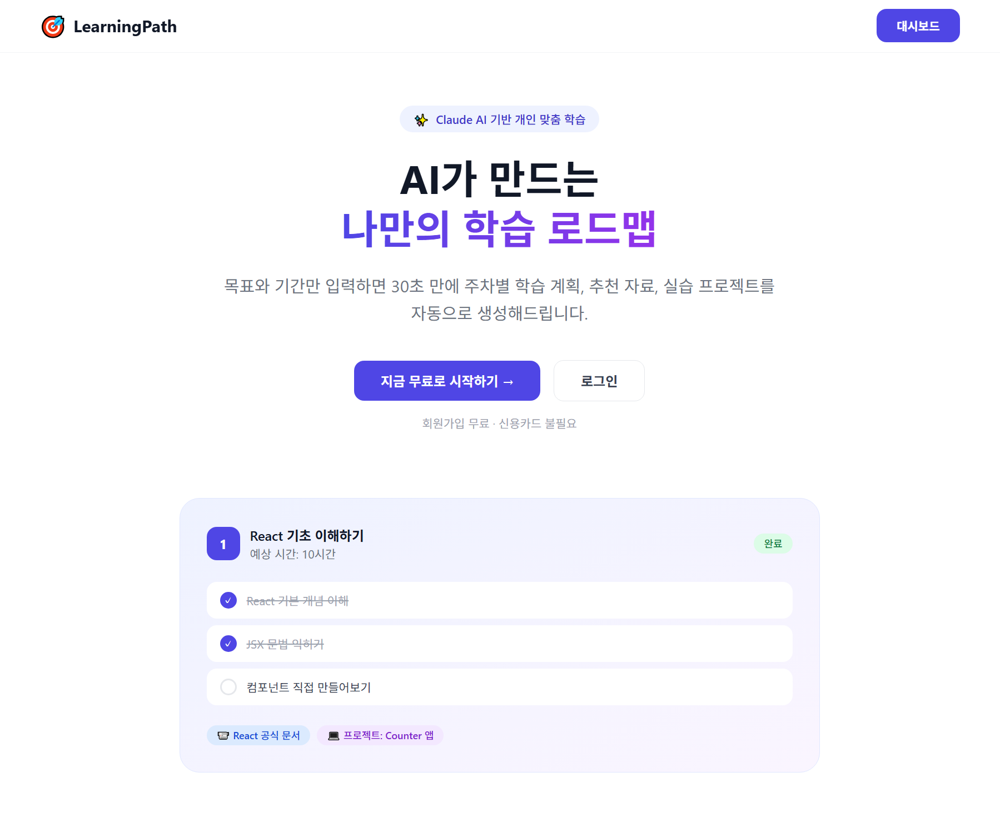
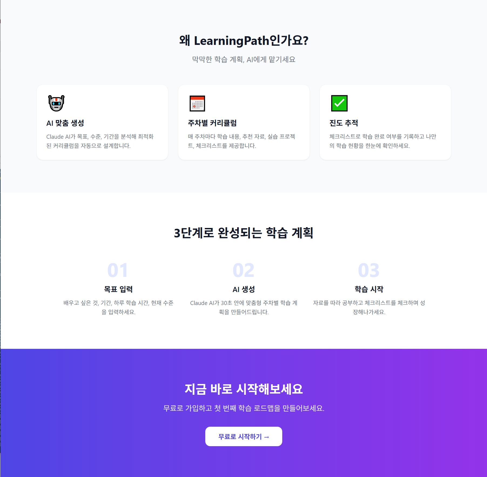
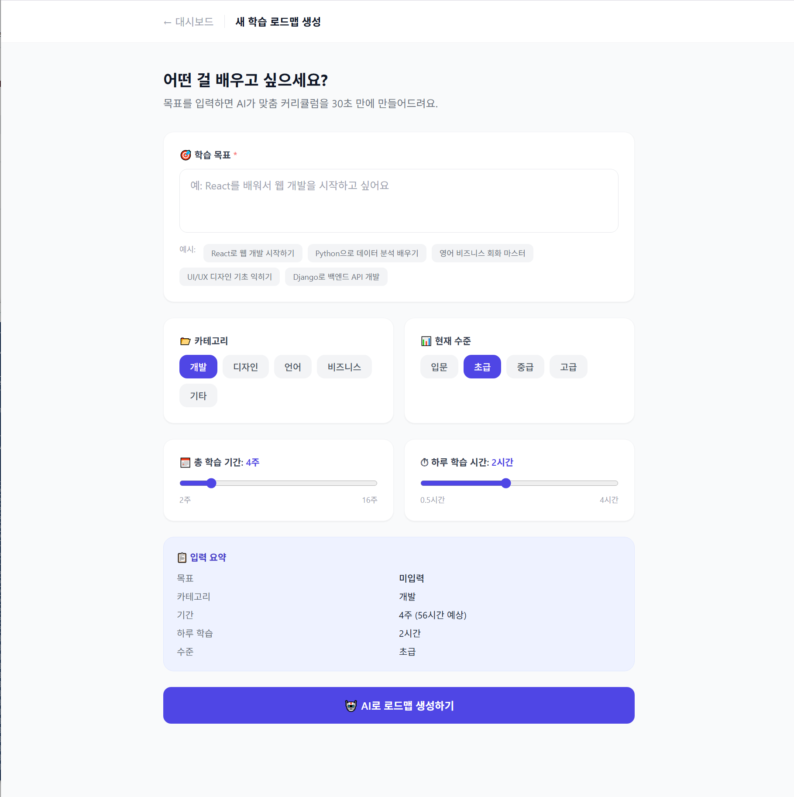

<div align="center">


<br/><br/>

# 🎯 LearningPath

### AI가 만드는 나만의 학습 로드맵

목표와 기간만 입력하면 **30초 만에** 주차별 학습 계획, 추천 자료, 실습 프로젝트를 자동 생성

> 데모 배포는 현재 내려가 있습니다. 아래 스크린샷과 로컬 실행 방법을 참고해 주세요.

</div>

---

## 📸 스크린샷

### 🏠 랜딩 페이지 — 히어로 섹션


### ✨ 기능 소개 — AI 맞춤 생성 · 주차별 커리큘럼 · 진도 추적


### 📋 로드맵 생성 — 목표 입력부터 AI 생성까지


---

## ✨ 주요 기능

**AI 맞춤 로드맵 생성** — 목표, 카테고리, 기간, 현재 수준을 입력하면 Claude AI가 주차별 커리큘럼을 자동으로 설계합니다.

**주차별 구조화된 커리큘럼** — 매 주차마다 학습 내용, 예상 소요 시간, 추천 자료(영상/문서/강의), 실습 프로젝트, 체크리스트를 제공합니다.

**실시간 진도 추적** — 체크리스트를 클릭해 완료 여부를 기록하고, 전체 진행률을 퍼센트로 확인할 수 있습니다.

**다양한 학습 분야 지원** — 개발, 디자인, 언어, 비즈니스 등 여러 카테고리와 입문~고급 수준을 지원합니다.

---

## 🛠 기술 스택

| 영역 | 기술 |
|------|------|
| **Frontend** | Next.js 14 (App Router), Tailwind CSS |
| **Backend** | Django 5.2, Django REST Framework |
| **AI** | Anthropic Claude API (`ANTHROPIC_MODEL`, 기본 `claude-haiku-4-5`) |
| **Database** | SQLite (개발) / PostgreSQL (운영) |
| **인증** | DRF Token Authentication |
| **배포** | Vercel (Frontend) + Railway (Backend) |

---

## 🚀 로컬 실행 방법

### 사전 요구사항
- Python 3.11+
- Node.js 18+
- Anthropic API Key

### 1. 저장소 클론
```bash
git clone https://github.com/bhj2837/learningpath.git
cd learningpath
```

### 2. 백엔드 실행
```bash
cd backend
python -m venv venv
venv\Scripts\activate        # Windows
# source venv/bin/activate   # macOS/Linux

pip install -r requirements.txt
```

`.env` 파일 생성 (프로젝트 루트). 템플릿을 복사해서 값만 채우면 됩니다:
```bash
cp ../.env.example ../.env
```

> ⚠️ `.env`는 `.gitignore`에 등록되어 있습니다. **절대 커밋하지 마세요.**
> 또한 `.gitignore`와 `requirements.txt`는 반드시 **UTF-8(BOM 없음)** 으로 저장해야 합니다.
> PowerShell의 `>` 리다이렉트는 UTF-16으로 저장되어 Git과 pip가 파일을 읽지 못합니다.

```bash
python manage.py migrate
python manage.py runserver   # http://localhost:8000
```

### 테스트 · 린트
```bash
cd backend
python manage.py test        # 34개 (IDOR·입력검증·인증·저장 회귀)
pip install ruff && ruff check .
```

### 3. 프론트엔드 실행
```bash
cd frontend
npm install
npm run dev                  # http://localhost:3000
npm run lint
```

---

## 📡 API 엔드포인트

| 메서드 | 엔드포인트 | 설명 |
|--------|-----------|------|
| `GET` | `/healthz/` | 헬스체크 (인증 불필요, DB 연결 확인) |
| `POST` | `/api/users/register/` | 회원가입 (비밀번호 검증기 적용, 20회/시간) |
| `POST` | `/api/users/login/` | 로그인 (토큰 반환, 20회/시간) |
| `POST` | `/api/users/logout/` | 로그아웃 |
| `GET` | `/api/roadmaps/roadmaps/` | 내 로드맵 목록 |
| `POST` | `/api/roadmaps/roadmaps/generate/` | ⭐ AI 로드맵 생성 (10회/시간) |
| `GET` | `/api/roadmaps/roadmaps/{id}/` | 로드맵 상세 |
| `PATCH` | `/api/roadmaps/roadmaps/{id}/` | 로드맵 수정 (상태 변경 등) |
| `DELETE` | `/api/roadmaps/roadmaps/{id}/` | 로드맵 삭제 (주차·체크리스트 함께 삭제) |
| `POST` | `/api/roadmaps/checklists/{id}/toggle_complete/` | 체크리스트 토글 |

목록 응답은 `PageNumberPagination`(20건)이 적용되어 `{count, next, previous, results}` 형태입니다.

> 🔒 모든 `/api/` 엔드포인트는 **요청한 사용자가 소유한 데이터만** 반환합니다.
> 남의 리소스 ID로 접근하면 `404`, 남의 로드맵을 FK로 지정해 쓰기를 시도하면 `400`이 반환됩니다.

### AI 로드맵 생성 예시

```json
POST /api/roadmaps/roadmaps/generate/
Authorization: Token your_token_here

{
  "goal": "React를 배워서 웹 개발 시작하기",
  "category": "개발",
  "duration_weeks": 4,
  "daily_hours": 2,
  "current_level": "초급"
}
```

---

## 📁 프로젝트 구조

```
learningpath/
├── .github/workflows/ci.yml  # 인코딩·시크릿·린트·테스트 회귀 방지 CI
├── .editorconfig             # UTF-8 / LF 고정 (UTF-16 사고 재발 방지)
├── .env.example              # 환경변수 템플릿 (.env는 커밋 금지)
├── backend/                  # Django 백엔드
│   ├── config/
│   │   ├── settings.py       # 프로젝트 설정
│   │   └── urls.py           # 메인 URL + /healthz/
│   ├── roadmaps/
│   │   ├── models.py         # Roadmap, Week, Checklist
│   │   ├── views.py          # 소유자 필터 믹스인 + AI 생성/응답 정규화
│   │   ├── serializers.py    # FK 소유권 검증
│   │   └── tests.py          # IDOR·입력검증·저장 회귀 테스트
│   ├── users/
│   │   ├── views.py          # 인증 API
│   │   └── tests.py
│   ├── Procfile              # Railway 배포 설정
│   ├── pyproject.toml        # ruff 설정
│   └── requirements.txt
├── frontend/                 # Next.js 프론트엔드
│   ├── app/
│   │   ├── components/
│   │   │   └── Header.js     # AppHeader / BackHeader 공용 헤더
│   │   ├── page.js           # 랜딩 페이지
│   │   ├── auth/page.js      # 로그인/회원가입
│   │   ├── dashboard/page.js # 로드맵 목록
│   │   ├── create/page.js    # 로드맵 생성
│   │   └── roadmaps/[id]/    # 상세 페이지
│   └── lib/
│       ├── api.js            # API 클라이언트 (ApiError, clearSession)
│       ├── constants.js      # 카테고리·수준·상태 (백엔드와 동기화 필요)
│       └── useAuth.js        # useRequireAuth / useIsLoggedIn
├── screenshots/              # 스크린샷
└── README.md
```

---

## ☁️ 배포

이 프로젝트는 **Railway**(백엔드) + **Vercel**(프론트엔드) 조합으로 배포됩니다.

### Railway (백엔드)
환경변수 설정:
```
ANTHROPIC_API_KEY=...
DJANGO_SECRET_KEY=...
DJANGO_DEBUG=False
ALLOWED_HOSTS=*.railway.app,your-domain.com
DATABASE_URL=postgresql://...  (Railway 자동 제공)
CORS_ALLOWED_ORIGINS=https://your-vercel-app.vercel.app
CSRF_TRUSTED_ORIGINS=https://your-vercel-app.vercel.app
```

> `DJANGO_SECRET_KEY`가 없으면 `DJANGO_DEBUG=False` 환경에서 기동이 거부됩니다(의도된 안전장치).
> 헬스체크 경로는 `/healthz/`입니다. 인증이 걸린 API 경로를 지정하면 항상 401이 되어 배포가 영구 unhealthy 상태가 됩니다.
> AI 생성은 30초 안팎이 걸리므로 gunicorn `--timeout 120`을 유지하세요.

### Vercel (프론트엔드)
환경변수 설정:
```
NEXT_PUBLIC_API_URL=https://your-railway-app.up.railway.app
```

---

## 📄 라이선스

MIT License

---

<div align="center">

Made with ❤️ and Claude AI

</div>
